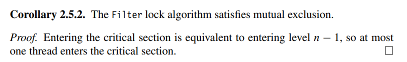
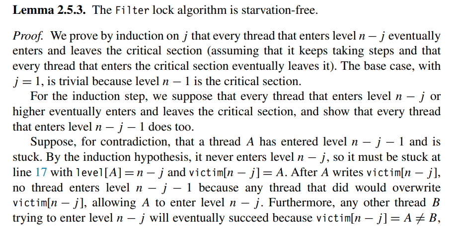

# Practica 4 

# Preguntas 

En el problema protegimos la seccion critica con el *Filter Lock*

1. ¿Tu solución cumple con Exclusión mutua? Argumenta porqué. 

2. ¿Tu solución cumple con Deadlock-free? Argumenta porqué. 
Como el algoritmo cumple con exclusion mutua y *starvation free* entonces es *deadlock free*
3. ¿Tu solución cumple con ser *starvation-free* ? Argumenta porqué. 

4. ¿Tu solución cumple con Justicia ? Argumenta porqué. En caso de que no lo cumpla, 
como podrías garantizarla. 

No un hilo puede quedarse mucho tiempo esperando hasta que entre a la zona critica. 